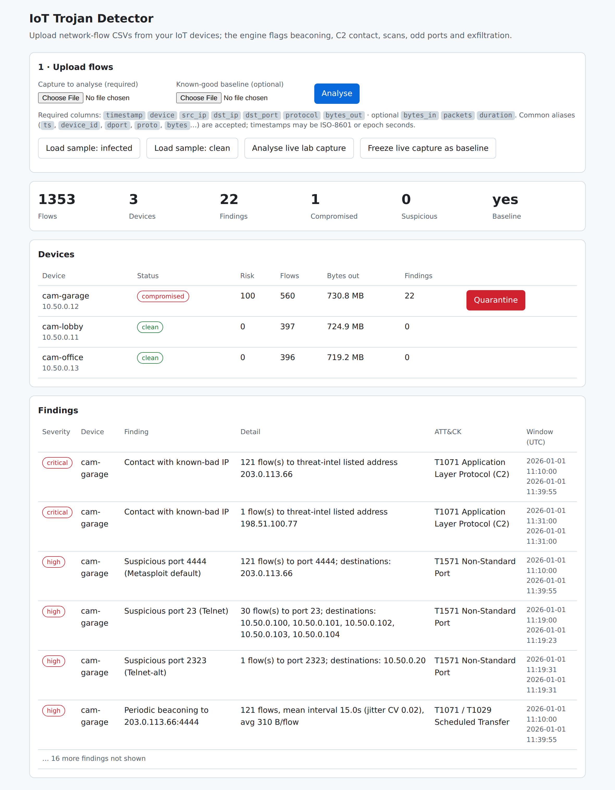

# IoT Trojan Detector

Spot trojan-like behaviour on IoT devices (cameras, sensors) from **network-flow CSVs**: no agent on the device,
no malware signatures. Includes a safe Docker lab with simulated cameras and a **harmless** trojan stand-in, so
the whole detect-and-contain story can be demoed repeatably.



Full documentation (architecture, data model, every screen, mobile view, deployment and a 5-minute demo script):
**[docs/IoT-Trojan-Detector-Documentation.pdf](docs/IoT-Trojan-Detector-Documentation.pdf)**

## Features
- **CSV upload** of flow records (`timestamp, device, src_ip, dst_ip, dst_port, protocol, bytes_out`, optional `bytes_in, packets, duration`); common column aliases and ISO/epoch timestamps accepted. Optional known-good **baseline** CSV.
- **Nine detection rules** mapped to MITRE ATT&CK: known-bad IP, suspicious ports, unusual ports, new external destinations, beaconing, host/port scans, large outbound transfers, flow-size outliers.
- **Baseline-aware beaconing**: regular but legitimate traffic (video, NTP, heartbeats) is not flagged.
- Per-device **risk score** (0-100) and status: clean / suspicious / compromised.
- **Quarantine / release** action (marker file in the lab; wire it to a firewall in production).
- **Docker lab**: looping RTSP stream, weak-login camera admin pages, fake C2 and a trojan simulator on an isolated network.
- Responsive UI, JSON API, 15 unit tests.

## Quick start

Detector only (no Docker):
```bash
make install
make run            # http://localhost:8080 , click "Load sample: infected"
```

Full lab (needs Docker):
```bash
make lab-up         # cameras, RTSP, fake C2, detector on :8080
# wait ~1 min, click "Freeze live capture as baseline"
make lab-infect     # start the harmless trojan simulator on cam-garage
# after ~2 min click "Analyse live lab capture", then Quarantine
make lab-down
```
Or upload your own CSV in the UI. Sample files are in `trojan-lab/sample_data/`.

## Scripts

| Command | What it does |
|---|---|
| `make install` | Install detector, pytest and docs dependencies |
| `make run` | Start the detector UI on port 8080 |
| `make test` | Run the unit tests |
| `make sample-data` | Regenerate the sample flow CSVs |
| `make lab-up` / `lab-infect` / `lab-down` | Start the lab / start the trojan simulator / tear down |
| `make screenshots` | Retake annotated screenshots with Playwright (`docs/build/capture_screenshots.py`) |
| `make pdf` | Rebuild the documentation PDF from HTML with Chromium (`docs/build/build_pdf.py`) |
| `make docs` | Screenshots then PDF |

Docs tooling needs Chromium: `playwright install chromium`, or set `CHROMIUM_PATH` to an existing binary.
Fonts (Inter, JetBrains Mono, OFL-licensed) are committed in `docs/build/fonts` and embedded in the PDF.

## Repository layout
```
trojan-lab/
  detector/     Flask app, analysis engine (engine.py), sample-data generator, UI template
  camera/ rtsp/ trojan_sim/ c2/ common/   lab simulators
  sample_data/  baseline, clean and infected flow CSVs
  tests/        pytest suite
  docker-compose.yml
docs/
  IoT-Trojan-Detector-Documentation.pdf
  screenshots/  annotated screenshots used by the PDF and README
  build/        screenshot + PDF generators, fonts, callout definitions
```

## Safety
The trojan is a simulator: it writes marker files, beacons text to a fake C2 container and logs flow records.
The lab network is `internal: true` (no route out). The camera admin login `admin/admin` is deliberately weak; never expose lab ports to untrusted networks.
The detector has no built-in authentication; put it behind a reverse proxy before any real deployment.
