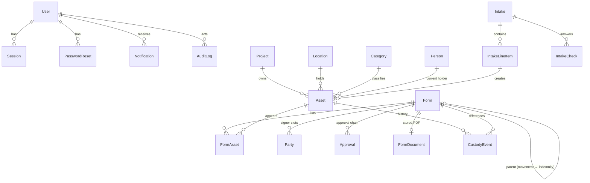

# ECEWS-ITAMS — Build Specification

Derived from the design package in `design/` (44 images, all reviewed) and the build brief. Where the two disagree, the brief's business rules win and the designs win on visual styling. Every resolution is listed in §9 and in `DECISIONS.md`.

## 1. Screen inventory → routes

| Design file | Route | Notes |
|---|---|---|
| (none — composed) | `/login` | Centered card, logo, email, password, "Forgot password?" link |
| `Forget Password.png` | modal on `/login` | Sends reset link (24 h, single-use) |
| (none — composed) | `/reset-password/:token` | New password + confirm |
| `Dashboard.png` | `/` | KPIs, Recent Actions, Needs Attention, Quick actions, Assets by project, bell |
| `Background+Border+Shadow.png` | popover from header bell (all app pages) | Notifications panel, Mark all read |
| `AB-05 · Asset Registry.png`, `-1` | `/assets` | Search + Category/Status/Project/Added filters, chips, server pagination; state in URL |
| `AB-06 · Asset Detail.png`, `-1` | `/assets/:tag` | Header + state actions, timeline, intake snapshot, lifecycle totals, barcode |
| `Background+Shadow.png` | modal on `/assets/:tag` | Generate report (single asset) |
| `Background+Shadow-5.png` | modal on `/assets/:tag` | Report damage (adapted: "Resulting status: Damaged") |
| (composed) | modals on `/assets/:tag` | Retire, Reinstate for repair, Delete (type tag) |
| `AB-07 · Intake Form.png`, `Background.png` | `/intake` (new) and `/intake/:id` (draft) | Form 1, autosave |
| `Background+Shadow-6.png` | modal on intake | Add line item (+ Result and Unit cost fields) |
| `Background+Shadow-8.png` | modal on intake | Validate & create assets |
| `Background+Shadow-1.png` | modal on intake/forms | Discard draft |
| `AB-08a · Issuance/Returns/Movements Registry.png` | `/forms?tab=issuance|return|movement` | Tabbed registries, per-asset rows |
| `AB-08a · Issuance Form.png`, `-1` | `/forms/new/issuance` (`/forms/:id/edit` for drafts) | Form 2 |
| `AB-08c · Return Form.png`, `-1` | `/forms/new/return` | Form 4 |
| `AB-08d · Movement Form-1.png` (newer wins) | `/forms/new/movement` | Form 3 with CTO → Admin approval chain |
| `Background+Shadow-14.png` | modal on forms | Add assets from registry (picker) |
| `Issuance confirmational modal.png`, `Background+Shadow-9.png` | modal on issuance | Send for signature (full variant used) |
| `Background+Shadow-11.png` | modal on return | Confirm return |
| `Background+Shadow-12.png` | modal on movement | Validate & send for signature (approval chain) |
| `AB-09 · Sign-offs.png` | `/signoffs` | KPIs, tabs, search, table, row actions |
| `Sign-off detail drawer.png`, `Background+VerticalBorder+Shadow.png` | drawer on `/signoffs` (and registries "View") | Full-height variant used |
| `Background+Shadow-4.png` | modal | Re-send signature request |
| `Background+Shadow-7.png` | modal | Email reminders (bulk) |
| `Background+Shadow-10.png` | modal | New form chooser |
| `AB-12 · Signed Document.png` | `/documents/:reference` | Signed document preview, Download PDF, Email copy |
| `Background+Shadow-13.png` | modal on document page | Email copy |
| `AB-10 · Reports.png` | `/reports` | KPIs + four reports × three formats |
| `Reports Download Modal.png`, `Background+Shadow-2.png` | modal on `/reports` | Export (custom filters on Asset register) |
| `Background+Shadow-3.png` | modal from sidebar | Sign out |
| `AB-11 · External Signature.png` | `/sign/:token` (public) | No login, noindex, mobile-first |
| (composed) | `/approve/:token` (public) | CTO / Admin Officer approve or reject |
| (composed) | `*` | 404 page; session-expired banner/redirect |
| `components.png` | `/dev/components` (dev only) | Component gallery |
| `Frame 4.png` | `public/logo.png` | Logo used as supplied |
| `Cover.png` | — | Not used in app |

## 2. Component inventory (from `components.png`)

Button (primary pill, primary large, outline-green "Export/Secondary/View", ghost/filter square, danger outline "Reject", amber outline "Report damage", icon button, small Approve/Reject/View pills), Badge, StatusBadge (dot + text; Damaged uses alert-triangle in tables per AB-05-1), WorkflowChip (Intake/Issuance/Movement/Return + Indemnity), Tabs (segmented pill with counts), FilterChip (removable), FilterButton ("Category: All" with popover), SearchInput (pill), Stepper (− n +), YesNoNa radio group + remark input, SignatureBlock, Timeline (colored nodes, cards, detail pills), Toast (green success, red error, dark info), EmptyState (dashed), Modal (header title/subtitle/close, body, dashed info note, footer), Drawer (right, full height), DataTable with pagination (1 2 3 … N), KpiCard (label, icon tile, value, sub), PageHeader (title, subtitle, action), SectionHeader (numbered green square), TagChip (green mono), PersonChip (initials avatar + name + sub), Field (uppercase label + input), FormatCard (radio card), CheckCard (checkbox card), InfoNote (dashed box with icon).

Tokens: see `src/client/styles/tokens.css` (hex values read from labels and confirmed by pixel sampling).

## 3. Status machine (authoritative)

States: `IN_STORE`, `ISSUED`, `DAMAGED`, `RETIRED`. Derived: `inRepair` (Damaged only), `damageOrigin` (Damaged only), `deletedAt` (Retired only).

| From | Action | To | Trigger |
|---|---|---|---|
| IN_STORE | ISSUE | ISSUED | Issuance form fully signed |
| IN_STORE | REPORT_DAMAGE | DAMAGED (REPORTED) | Report damage modal |
| IN_STORE | MOVE | IN_STORE | Location movement fully signed |
| ISSUED | RETURN_GOOD (Good/Fair) | IN_STORE | Return acknowledged by signature |
| ISSUED | RETURN_DAMAGED (Poor/Damaged) | DAMAGED (RETURNED) | Return acknowledged |
| ISSUED | REPORT_DAMAGE | DAMAGED (REPORTED), holder kept | modal |
| ISSUED | MOVE | ISSUED (holder/location change) | Movement approved + signed |
| DAMAGED | SEND_FOR_REPAIR | DAMAGED + inRepair | Movement to vendor approved (CTO+Admin) |
| DAMAGED+inRepair | RECEIVE_BACK_GOOD | IN_STORE, repair closed | Vendor return signed, Good/Fair |
| DAMAGED+inRepair | RECEIVE_BACK_FAULTY | DAMAGED, repair closed | Vendor return signed, Poor/Damaged |
| DAMAGED (any) | RETIRE | RETIRED | Retire modal (IT_ADMIN) |
| RETIRED | REINSTATE | DAMAGED | Committed atomically with the Send for Repair movement submission (IT_ADMIN) |
| RETIRED | DELETE | RETIRED + deletedAt | Delete modal (IT_ADMIN), soft delete |

Everything else → HTTP 409 with a human message. Header actions per state: In Store → Issue, Report damage; Issued → Return, Report damage; Damaged → Send for Repair, Retire; Damaged+inRepair → Receive back, Retire; Retired → Repair, Delete. "Generate report" always.

The machine lives in `src/shared/statusMachine.ts` (pure) with a table-driven test of every state × action.

## 4. Form states

**Intake (Form 1):** `DRAFT` → `VALIDATED` (terminal, idempotent). Draft may be discarded (deleted; no assets exist).

**Signable forms (Issuance/Return/Movement/Indemnity):** `DRAFT` → (`PENDING_APPROVAL` movements only) → `AWAITING` → `PARTIAL` → `SIGNED`. Side exits: `EXPIRED` (link lapsed; Re-send returns it to AWAITING/PARTIAL), `REJECTED` (approval rejected), `CANCELLED` (IT cancels an unsigned form). Final: SIGNED, REJECTED, CANCELLED. Active (lock-holding): PENDING_APPROVAL, AWAITING, PARTIAL, EXPIRED. Drafts do not lock assets; the lock is taken when the form is sent.

Signer slots (`Party`): ISSUANCE → RECIPIENT (+ ISSUER auto counter-sign); RETURN → RETURNER (+ RECEIVER = IT, recorded); MOVEMENT → HANDOVER (current staff holder, if any) + COUNTERPARTY (location responsible person or vendor contact) ; INDEMNITY (child of a staff→staff movement) → RECIPIENT (+ ISSUER). Movement completes when the movement's parties and its child indemnity are all signed.

Approvals (movement only): CTO (order 1) then ADMIN_OFFICER (order 2), single-use email links. Reject at either step → REJECTED, lock released, IT notified.

## 5. Data model (ER)

Key constraints: `Asset.tag` unique (from sequence `asset_tag_seq`), `(make, serial)` unique where serial present, `FormAsset(assetId) WHERE active` partial unique index (one active form per asset), `Form.reference` unique, `Party.tokenHash` / `Approval.tokenHash` unique, CHECK constraints on damage origin only when Damaged, `deleted_at` only when Retired. Numbering sequences per prefix: `ref_iss_seq`, `ref_rtr_seq`, `ref_mvt_seq`, `ref_ind_seq`, `ref_in_seq`. `CustodyEvent` protected by a trigger that rejects UPDATE/DELETE.

## 6. API (all JSON, Zod-validated; `/api` prefix)

Auth: `POST /auth/login`, `POST /auth/logout`, `GET /auth/me`, `POST /auth/forgot`, `POST /auth/reset`.
Meta: `GET /meta` (categories, projects, locations), `GET /people?q=&type=` (typeahead), `GET /nav-counts`, `GET|POST /users`, `PATCH /users/:id` (IT_ADMIN).
Assets: `GET /assets`, `GET /assets/:tag`, `POST /assets/:tag/report-damage`, `POST /assets/:tag/retire`, `POST /assets/:tag/delete`, `GET /assets/:tag/report`.
Intake: `POST /intakes`, `GET /intakes/:id`, `PATCH /intakes/:id`, `DELETE /intakes/:id`, `POST /intakes/:id/validate`, `GET /intakes/tag-preview`.
Forms: `POST /forms` (create draft or create+send, `Idempotency-Key` header), `GET /forms/:id`, `PATCH /forms/:id`, `DELETE /forms/:id` (discard draft), `POST /forms/:id/send`, `POST /forms/:id/cancel`, `POST /forms/:id/resend`, `POST /forms/remind` (bulk), `GET /forms/:id/document` (HTML), `GET /forms/:id/pdf`, `POST /forms/:id/email-copy`, `GET /forms/by-ref/:reference`.
Lists: `GET /registries/:type`, `GET /signoffs`, `GET /signoffs/summary`, `GET /dashboard`, `GET /notifications`, `POST /notifications/read-all`.
Reports: `GET /dashboard`, `GET /reports/summary`, `GET /reports/:report/count`, `GET /reports/:report/export?format=...&filters`, `GET /assets/:tag/report?format=&timeline=&intake=`.
Notifications: `GET /notifications`, `POST /notifications/read-all`, `POST /notifications/:id/read`.
Public (no session, rate-limited, noindex): `GET|POST /public/sign/:token`, `GET|POST /public/approve/:token`.
Health: `GET /health`.

## 7. Email templates

1. Signature request (Issuance / Return / Movement / Indemnity) — "Please sign: ISS-0142 - Issuance & indemnity form", Review & sign button.
2. Reminder (auto 48 h, manual Resend/Remind, bulk) — "Reminder: please sign …".
3. Approval request (CTO, Admin Officer) — approve/reject link.
4. Signature receipt to signer (with PDF attached once fully signed).
5. Email copy (PDF attachment).
6. Password reset.
7. Movement overdue-return reminder (to IT creator).
8. Rejection notice to IT.

## 8. Background jobs (node-cron, advisory-locked)

- every 5 min: expire lapsed signature/approval links → form EXPIRED, notification.
- every 15 min: 48 h auto-reminder (once per link issue).
- every 15 min: "link expires in 24 h" notifications.
- hourly: vendor movement expected-return overdue → notification + email to IT (once per day per movement).
- hourly: overdue temporary issuances (≥ 90 days) → notification (once).
- hourly: purge expired sessions and reset tokens.

## 9. Inconsistencies found and resolutions

1. Form numbering: chooser says Issuance = Form 2, Return = Form 4, Movement = Form 3; Return and Movement screen subtitles say "Form 2". → Use the chooser numbering everywhere.
2. Intake bar "4 of 6 checks passed" with 7 questions. → "X of Y": Y = questions not answered N/A, X = questions answered Yes.
3. "Add from In Stock / In Store" on the return form. → "Add issued items" (vendor mode: "Add items in repair"). Movement form button → "Add items".
4. "In Stock" everywhere in designs. → "In Store".
5. "Pending Resolution"/"Pending Res." badge, intake subtitle, Report damage resulting-status chips, Add line item note, Confirm return note, mismatch toast. → Damaged + "Failed intake" chip; copy rewritten without the term.
6. "Under Repair" as a state. → Display variant of Damaged while `inRepair`.
7. Asset detail header shows "Indemnity ISS-0142" while the timeline shows the asset re-issued under ISS-0161. → Chip shows the *current* indemnity (ISS-0161 in seed).
8. Placeholder counts differ across mockups (382 vs 282 vs 214 vs 123). → All computed.
9. Dashboard Recent Actions shows "ISS-0142" on Movement rows. → Real references.
10. Radii: brief says 8, components.png says 6. → 6 (design is the styling source of truth).
11. Movement form: older variant (staff → staff with two signature chips) vs newer (CTO/Admin approval emails). → Newer wins; signer chips still shown, plus CTO/Admin email fields.
12. Return form "Returning staff member" only. → Returner type toggle Staff / Vendor.
13. Report damage "Notes (optional)". → Required (≥ 10 chars), label "Notes".
14. Add line item modal has no pass/fail. → Result chips (Passed/Failed) and optional unit cost added in the same style.
15. Sign-offs "Signed this week" sub-copy "back in Sign-offs automatically" kept; KPI computed.
16. Dashboard quick action "New Movements" kept as designed copy.
17. AB-12 header back link says "Asset Registry" — kept but returns to the page the user came from.
18. Reports KPI "By project 12 locations & projects" → count of projects + locations.
